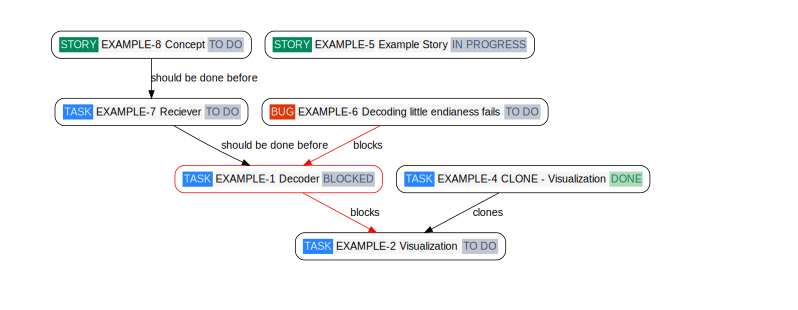

# jira-issue-graph

Create a directed graphviz graph of issues and relations from a jql query



# Motivation

- The [Advanced Roadmaps](https://www.atlassian.com/de/software/jira/pricing) feature from [Atlassian](https://www.atlassian.com) isn't available for every model (currently only for Premium and Enterprise)
    - Even if it is available 
        - it is AFAIK limited to `blocked` relations
        - you might not have the rights to configure it (the query and/or relations)
- When dealing with relations across multiple tools, companies or sites this script can be a basis to create a merged issue graph

# Notes

## Security

The following secure information must be provided using environment variables:

```python
server = os.getenv('JIRA_SERVER')
user = os.getenv('JIRA_USER')
apiKey = os.getenv('JIRA_PASSWORD')
```

e.g.

```bash
# your site's root url
JIRA_SERVER="https://<>.atlassian.net"
# your user name e.g. e-mail
JIRA_USER="<USERNAME>"
# your personal access token
JIRA_PASSWORD="<PAT>"
```

## Internationalization

There are some places where JIRA internationalizes the fields names e.g. `In Arbeit` (is german for `In Progress`). 
Changing my personal language settings to english US was sufficient for me: [JIRA Personal Settings](https://id.atlassian.com/manage-profile/account-preferences?ref=jira&src=personalsettings). Otherwise the following keys must be adapted:

```python
color = {
    "Task": {"fgcolor": "#DEEBFF", "bgcolor": "#2684FF"},
    "Story": {"fgcolor": "#E3FCEF", "bgcolor": "#00875A"},
    "Bug": {"fgcolor": "#FFEBE6", "bgcolor": "#DE350B"},
    "Epic": {"fgcolor": "#EAE6FF", "bgcolor": "#5243AA"},
    "To Do": {"fgcolor": "#42526e", "bgcolor": "#c1c7d0"},
    "In Progress": {"fgcolor": "#42526e", "bgcolor": "#c1c7d0"},
    "Blocked": {"fgcolor": "#42526e", "bgcolor": "#c1c7d0"},
    "Done": {"fgcolor": "#00875a", "bgcolor": "#b2d8b9"}
}
```

# Features

- ✅ Visualize all relation types
- ✅ Hyperlink to issue in graph node
- ✅ Blocked issues and blocking relations highlighted in red

# Usage

```
usage: issue-graph.py [-h] --query QUERY [--ignore-clones] [--output OUTPUT]

Exports a JIRA issue graph as a Graphviz digraph.

optional arguments:
  -h, --help       show this help message and exit
  --query QUERY    A valid JQL query providing issues.
  --ignore-clones  If set clone relations are being ignore.
  --output OUTPUT  If defined the graph's source will be written to this file, otherwise to the command line.
```